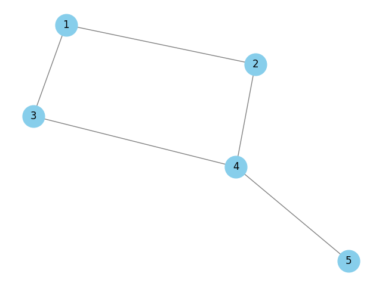

# Аналіз графів та алгоритмів пошуку шляхів

## Завдання 1: Створення та візуалізація графа

Для моделювання реальної мережі було створено граф за допомогою бібліотеки `networkx`. Граф складається з 5 вершин та 5 ребер. Візуалізація графа збережена у файлі `Figure_1.png`.

### Основні характеристики графа:
- Кількість вершин: 5
- Кількість ребер: 5
- Ступені вершин: {1: 2, 2: 2, 3: 2, 4: 3, 5: 1}

## Завдання 2: Реалізація алгоритмів DFS та BFS

Було реалізовано два алгоритми пошуку шляхів у графі: DFS (глибина першим) та BFS (ширина першим).

### Результати виконання алгоритмів:
- Шляхи DFS: [[1, 3, 4, 5], [1, 2, 4, 5]]
- Шляхи BFS: [[1, 2, 4, 5], [1, 3, 4, 5]]

### Порівняння результатів:
Алгоритм DFS шукає шлях, заглиблюючись у граф якомога далі, перш ніж повернутися назад. Це призводить до того, що шляхи DFS можуть бути довшими та менш оптимальними. У нашому випадку, DFS знайшов два шляхи: [1, 3, 4, 5] та [1, 2, 4, 5].

Алгоритм BFS шукає шлях, розширюючись на всі сусідні вершини на кожному рівні, перш ніж перейти до наступного рівня. Це гарантує, що знайдений шлях буде найкоротшим. У нашому випадку, BFS також знайшов два шляхи: [1, 2, 4, 5] та [1, 3, 4, 5].

### Пояснення різниці:
Різниця між шляхами, знайденими алгоритмами DFS та BFS, полягає в їх підході до пошуку. DFS заглиблюється у граф, що може призвести до довших шляхів, тоді як BFS розширюється рівнями, що гарантує знаходження найкоротшого шляху.

## Завдання 3: Реалізація алгоритму Дейкстри

Було реалізовано алгоритм Дейкстри для знаходження найкоротшого шляху у графі. До ребер графа було додано ваги, і алгоритм знайшов найкоротші шляхи від вершини 1 до всіх інших вершин.

### Найкоротші шляхи за алгоритмом Дейкстри:
- {1: [1], 2: [1, 2], 3: [1, 3], 4: [1, 2, 4], 5: [1, 2, 4, 5]}

### Пояснення:
Алгоритм Дейкстри гарантує знаходження найкоротшого шляху у графі з вагами. У нашому випадку, найкоротші шляхи від вершини 1 до інших вершин були знайдені з урахуванням ваг ребер.
